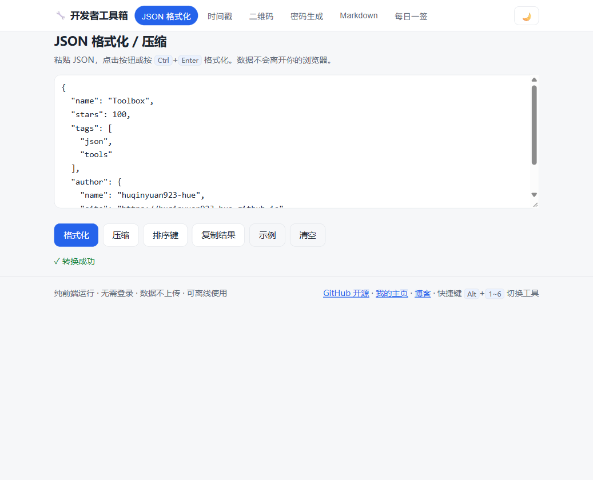

# 🔧 开发者工具箱 · Toolbox

[](https://huqinyuan923-hue.github.io/toolbox/)
[](LICENSE)
[](#-技术栈)

一组免费、无需登录、**纯前端运行**的日常小工具。所有计算都在你的浏览器里完成，数据不会上传到任何服务器，并支持**离线使用**（PWA）。

**在线使用 → <https://huqinyuan923-hue.github.io/toolbox/>**




## ✨ 功能

| 工具 | 说明 |
|---|---|
| JSON 格式化 | 格式化 / 压缩 / 递归排序键，出错时报到具体的**行:列**；`Ctrl+Enter` 快捷格式化 |
| 时间戳转换 | 秒/毫秒自动识别互转，附**相对时间**（如"3 天后"），实时时间戳一键复制 |
| 二维码生成 | 容错等级 L/M/Q/H 可选、三种尺寸，可下载 PNG（文件名自动带日期） |
| 密码生成 | 基于 `crypto.getRandomValues`，可选字符集 + 排除易混淆字符，实时**强度条（熵）**，设置自动记住 |
| Markdown 预览 | 左写右看，**语法工具栏**、字数统计、**草稿自动保存**，链接统一安全跳转 |
| 每日一签 | 按本地日期确定性挑选一句话 + 每日配图，同一天所有人看到同一句 |
| 颜色工具 | HEX / RGB / HSL 互转 + 明暗色阶，点击复制 |
| 单位换算 | 长度 / 重量 / 数据大小 / 温度 |
| 进制转换 | 2 / 8 / 10 / 16 / 36 进制同时转换 |
| 编码转换 | URL 编解码、Base64（支持中文）、Unicode 转义 |
| 正则测试 | 实时高亮匹配与捕获组 |
| 文本对比 | 逐行 LCS diff，绿色新增 / 红色删除 |
| Cron 解析 | 中文含义 + 未来 5 次执行时间 + 常用示例 |
| UUID 生成 | UUID v4 / 12 位短 ID，批量生成 |
| 哈希计算 | SHA-1 / 256 / 384 / 512（浏览器原生 crypto） |
| 文本统计 | 字符 / 中文字数 / 英文单词 / 行段 / 阅读时长 |
| 音乐解锁 | 酷狗 KGM/KGMA/VPR → MP3/FLAC 无损还原，浏览器本地解密（算法来自开源 unlock-music，仅限个人合法文件） |
| JWT 解析 | 解码 Header/Payload 与时间声明（仅解码展示，不验证签名） |
| 占文生成 | 中文随机占位文本，为排版原型填充内容 |
| 对比度检查 | WCAG 2.x 前景/背景对比度 + AA/AAA 达标 + 实时预览 |
| 每日一签 | 按日期确定性挑选一句话 + 每日配图，同一天所有人看到同一句 |

共 **20 个工具**。

## 🎹 快捷键

| 按键 | 作用 |
|---|---|
| `Alt` + `1~6` | 切换到对应工具 |
| `←` / `→` / `Home` / `End` | 标签间移动（符合 ARIA tabs 规范） |
| `Ctrl` + `Enter`（JSON 页） | 快速格式化 |

## 🚀 使用 / 部署

纯静态站点，无需构建：

```bash
# 本地预览：直接双击 index.html，或
npx serve .
```

部署到 GitHub Pages：仓库 Settings → Pages → 选择 `main` 分支根目录即可。

## ➕ 添加新工具

1. 在 `index.html` 的 `role="tablist"` 里加一个 `<button role="tab" data-tool="你的工具名">`
2. 添加 `<section id="tool-你的工具名" class="tool-panel" role="tabpanel">` 面板
3. 在 `script.js` 里写逻辑；`TOOL_NAMES` 里补个名字，标签切换、`Alt+数字` 快捷键、hash 路由自动生效

## ♿ 无障碍与体验

- 完整的 ARIA tabs 语义 + 键盘导航 + 跳转正文的 skip link
- 深浅色主题，未手动选择时跟随系统（`prefers-color-scheme`），支持 `prefers-reduced-motion`
- 所有状态消息带 `aria-live`，复制操作有可视反馈

## 📝 更新日志

### v1.4 · 2026-10-06（凑满 20 个工具）

- **新增 3 个工具**：JWT 解析（含 exp 过期徽章，明确提示不验证签名）、中文占文生成、WCAG 对比度检查器（AA/AAA 达标 + 实时预览）
- SW 缓存版本升级至 v5

### v1.3 · 2026-10-06（音乐解锁）

- **新增「音乐解锁」工具**：酷狗 KGM/KGMA/VPR → MP3/FLAC 无损还原（流密码解密，非转码）
- 解密在浏览器本地完成，文件不上传；算法与掩码常量来自开源项目 unlock-music / kugou-crypto
- 首次使用需联网加载一次解密表（`kgm-v2-mask.bin`，gzip 后 1.1MB，支持 ≤104MB 加密音频），之后离线可用
- 仅限转换个人合法获取的音乐文件，请勿传播解密结果

### v1.2 · 2026-10-06（工具箱扩容至 16 个）

- **新增 10 个工具**：颜色工具（HEX/RGB/HSL 互转+色阶）、单位换算（长度/重量/数据/温度）、进制转换（2/8/10/16/36）、编码转换（URL/Base64/Unicode）、正则测试（实时高亮+捕获组）、文本对比（逐行 LCS diff）、Cron 解析（中文含义+未来执行时间）、UUID 生成（v4/短 ID 批量）、哈希计算（SHA-1/256/384/512）、文本统计（字词行段+阅读时长）
- 快捷键说明更新为 `Alt`+数字；SW 缓存版本升级至 v3

### v1.1 · 2026-10-06（100 项细节优化）

- **修复**：每日一签用 UTC 日期取签文，晚间会显示"昨天"的内容 → 改为本地日期
- **修复**：README 声明 MIT 但缺少 LICENSE 文件
- **新增**：PWA 离线缓存（Service Worker + manifest + PNG/SVG 图标）
- **新增**：JSON 排序键、示例填充、错误行列定位、`Ctrl+Enter`
- **新增**：时间戳相对时间显示、"填入现在"、当前时间戳一键复制
- **新增**：二维码容错等级与尺寸选择、日期命名下载、行内错误提示
- **新增**：密码强度条（熵）、排除易混淆字符、设置持久化
- **新增**：Markdown 语法工具栏、字数统计、草稿本地保存
- **优化**：CDN 库改为按需懒加载，首屏不再下载二维码/Markdown 库
- **优化**：`alert()` 全部替换为行内消息；复制操作增加可视反馈
- **优化**：ARIA 标签语义、键盘导航、`aria-live`、skip link、焦点样式
- **优化**：每日配图加载失败有优雅兜底；预览链接统一 `noopener noreferrer`
- **优化**：SEO meta / Open Graph / canonical / theme-color
- **优化**：移动端横滑导航、深色滚动条、过渡动画（尊重 reduced-motion）

### v1.0 · 2026-10-06

- 首个版本：6 个工具上线 GitHub Pages

## 🛠 技术栈

HTML + CSS + 原生 JavaScript，零框架、零构建。二维码与 Markdown 渲染通过 CDN 按需加载 [qrcode-generator](https://github.com/kazuhikoarase/qrcode-generator)、[marked](https://github.com/markedjs/marked)、[DOMPurify](https://github.com/cure53/DOMPurify)。

## 📄 License

[MIT](LICENSE)
